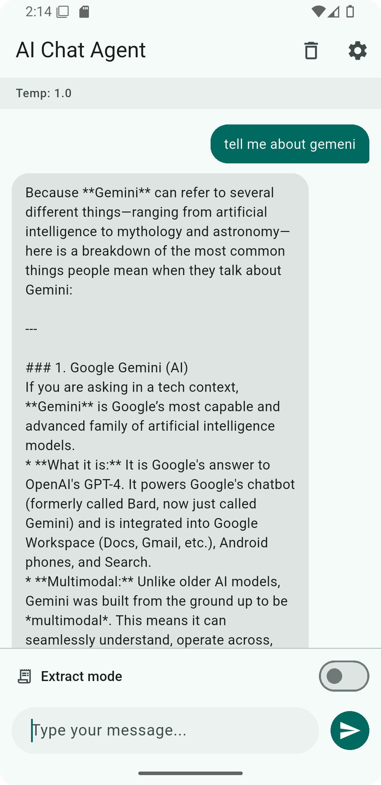
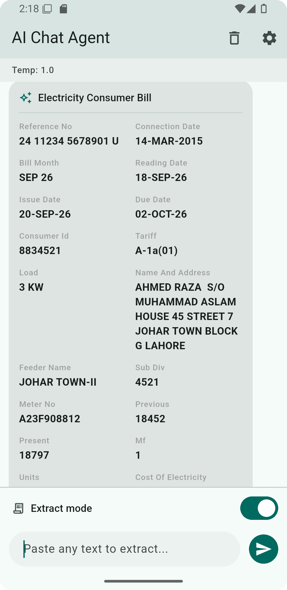
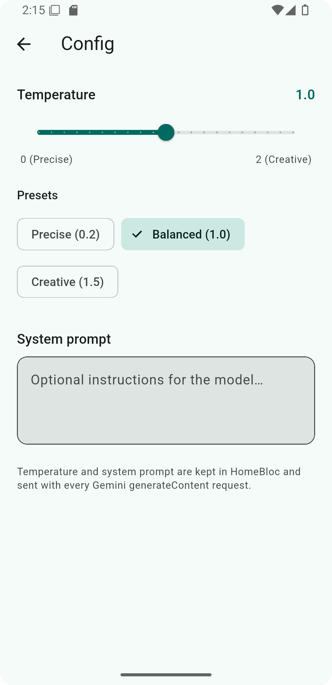

# 🤖 Flutter AI Playground

A Flutter app to explore how LLMs work, built with the Gemini API.

## 🎬 Demo


| Chat | Extract mode | Settings |
|------|--------------|----------|
|  |  |  |

> Placeholders. Add `assets/demo.gif` and the screenshots to show the app in action.

## ✨ Features

- **Streaming chat (SSE).** Replies appear word by word as Gemini writes them. The full conversation history is sent with every request, so the model keeps context.
- **Stop button.** Cancel a reply mid-stream. The text received so far is kept.
- **Settings.**
  - Temperature slider from 0 to 2.
  - Presets: Precise (0.2), Balanced (1.0) and Creative (1.5).
  - Editable system prompt, sent with every chat request.
- **Token usage.** Input, output and thinking tokens are shown under every reply.
- **Generic Extract mode.** Paste any unstructured text, such as an order message, a utility bill or a receipt. Gemini returns a clean card with a document title and label-value pairs. This uses Gemini structured output (`responseSchema`).
- **Follow-up questions.** Switch Extract mode off and ask about the extracted data in chat. The pasted text and the extracted fields are part of the chat history, so answers are based on them.

## ⚙️ How it works

Every action follows the same one-way flow:

```
UI (screens/, widgets/)
  → HomeBloc (bloc/home/)        events in, states out
  → GeminiService (repo/)        builds the Gemini request, parses the response
  → ApiClient (networking/)      sends HTTP requests, turns errors into ApiException
  → Gemini API
```

The response travels back the same way. The Bloc emits a new state and the UI rebuilds.

### Three types of request

| Request | Endpoint | Used for |
|---------|----------|----------|
| Streaming | `models/{model}:streamGenerateContent?alt=sse` | Chat (default) |
| Non-streaming | `models/{model}:generateContent` | Chat (when streaming is turned off in code) |
| Structured JSON | `models/{model}:generateContent` with `responseMimeType` and `responseSchema` | Extract mode |

In Extract mode, only the pasted text is sent, with no chat history. Gemini must answer with JSON in this shape:

```json
{
  "title": "Electricity Bill",
  "fields": [
    { "label": "Due Date", "value": "15 Oct 2026" },
    { "label": "Amount", "value": "Rs. 4,250" }
  ]
}
```

### Folder structure

```
lib/
├── bloc/home/     HomeBloc, events and state (status, messages, settings, extract mode)
├── repo/          GeminiService: sendMessage, streamMessage, extractData
├── networking/    ApiClient (post, postStream) and ApiException
├── models/        ChatMessage, GeminiResponse, StreamEvent, ExtractedField
├── widgets/       MessageBubble, ExtractCard, ChatMessageList, ChatInputBar, ...
├── screens/       HomeScreen (wiring only) and SettingsScreen
└── main.dart      Creates HomeBloc(GeminiService())
```

### Debug logs

Every request and response is printed to the console with a tag. Search for `[REQUEST]`, `[RESPONSE]`, `[STREAM]` or `[ERROR]` to see exactly what is sent to Gemini and what comes back. The API key is never printed.

## 🛠️ Tech stack

| Area | Choice |
|------|--------|
| Framework | Flutter, Dart |
| State management | flutter_bloc, equatable |
| Networking | http (with `AbortableRequest` for the Stop button) |
| AI | Gemini API: `generateContent`, `streamGenerateContent` with SSE, JSON schema output |
| Model | `gemini-3.5-flash-lite`, with `thinkingLevel: minimal` |

## 🚀 Getting started

### Prerequisites

- Flutter SDK (Dart 3.9 or later)
- A free Gemini API key from [Google AI Studio](https://aistudio.google.com/apikey)

### Setup

1. Clone the repository:

   ```bash
   git clone https://github.com/<your-username>/flutter-ai-playground.git
   cd flutter-ai-playground
   ```

2. Install dependencies:

   ```bash
   flutter pub get
   ```

3. Add your API key. Copy the example file to `env.json`:

   ```bash
   cp env.example.json env.json
   ```

   Open `env.json` and replace `YOUR_GEMINI_API_KEY` with your key:

   ```json
   {
     "GEMINI_KEY": "YOUR_GEMINI_API_KEY"
   }
   ```

4. Run the app:

   ```bash
   flutter run --dart-define-from-file=env.json
   ```

   In Android Studio or VS Code, add `--dart-define-from-file=env.json` to the run arguments.

`env.json` is listed in `.gitignore`, so your key is never committed. Only `env.example.json`, which holds a placeholder, is in the repository.

You can also pass the key directly without a file:

```bash
flutter run --dart-define=GEMINI_KEY=your_key
```

### Free-tier rate limits

The free tier limits how many requests and tokens you can use per minute and per day. If you send messages too quickly, the API returns an error and the app shows it in a SnackBar. Wait a moment and try again. See [Gemini API rate limits](https://ai.google.dev/gemini-api/docs/rate-limits) for current numbers.

## 📚 What I learned

- **LLMs are stateless.** The model remembers nothing between requests. To keep a conversation going, the full history must be sent every time.
- **Temperature controls randomness.** Low values give focused, repeatable answers. High values give more varied ones. On newer models the effect is subtle, and the defaults usually work well.
- **System prompts shape behaviour.** A short instruction sent with every request sets the tone, role and rules for the model.
- **Tokens drive cost and limits.** Input, output and thinking tokens are counted separately. Long chats get more expensive because the whole history is resent each time.
- **Streaming vs non-streaming.** Both return the same answer. Streaming feels much faster because the first words arrive almost at once, and it allows a Stop button.
- **Structured output.** With `responseMimeType: application/json` and a `responseSchema`, the model returns data the app can parse safely instead of free text.

## 🔒 Security note

The API key is passed at build time with `--dart-define`. This is fine for learning, but the key ends up inside the app and can be extracted. In production, call Gemini from your own backend, or use [Firebase AI Logic](https://firebase.google.com/docs/ai-logic), so the key never ships with the app.

## 🗺️ Roadmap

This is the first project in my AI learning path. Next:

- **RAG:** answer questions from my own documents.
- **AI agents:** let the model plan steps and call tools.
- **MCP:** connect the model to external tools and data through the Model Context Protocol.

## 👤 Author

**Muhammad Waqas Afzal**
Mobile Developer (Flutter, iOS, Android)

- LinkedIn: [your-linkedin-url](https://www.linkedin.com/in/your-profile)
- GitHub: [your-github-url](https://github.com/your-username)
